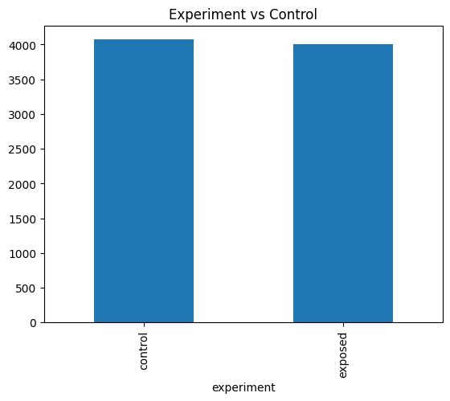
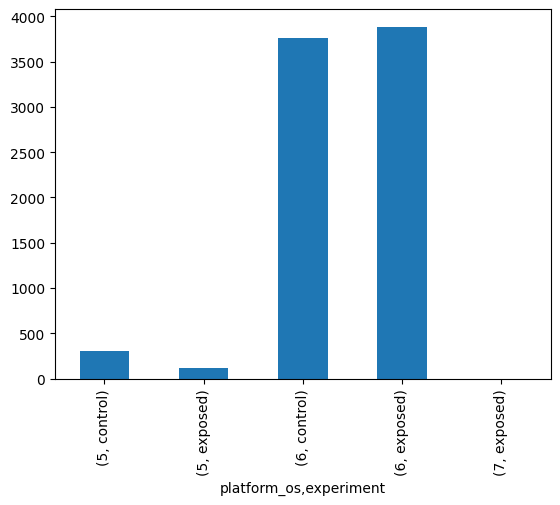
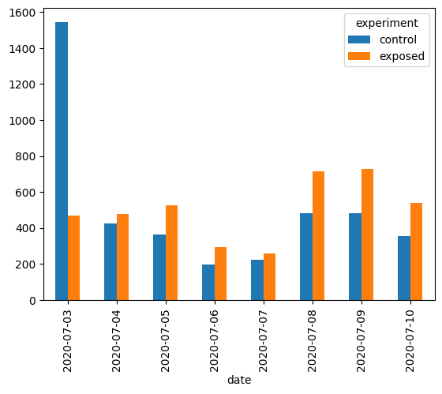
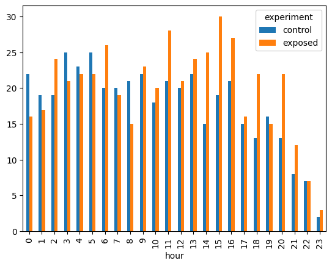
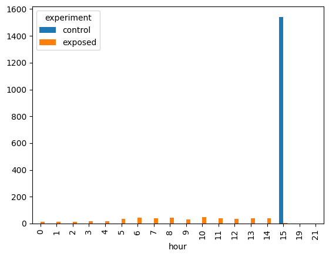
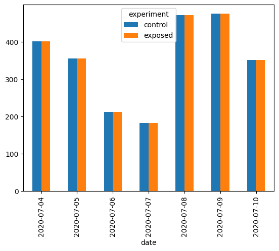
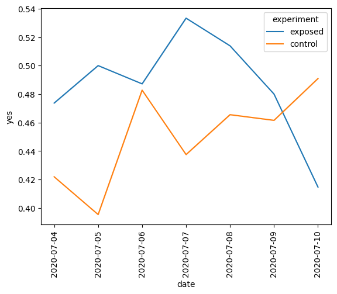
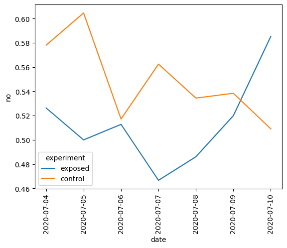
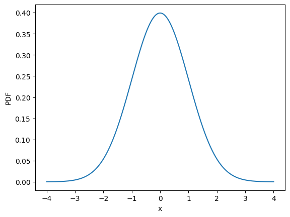
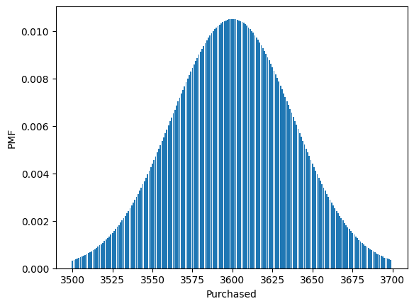

## Introduction
Hello. This is an A/B testing guide which I am building for myself. The goal is to review exploratory data analysis topics as well as diving deep into A/B testing.

Dataset: Ad AB testing dataset from kaggle
URL: https://www.kaggle.com/datasets/osuolaleemmanuel/ad-ab-testing

#### Goal
The main goal of this notebook is to cover EDA topics as well as A/B testing topics
1. EDA
2. Setting up the experiment parameters and explaination for the same
3. Measuring the experiment parameters and explaination


```python
import pandas as pd
import numpy as np
from scipy.stats import binom #for demonstrating binomial distribution and CLT
from scipy.stats import norm #for demonstrating normal distribution and CLT
from statsmodels.stats.power import TTestIndPower #used for testing power of the experiment
from statsmodels.stats.proportion import proportion_effectsize # used to calculate standardized effect size
import statsmodels.stats.multitest as smt #
from statsmodels.stats import power
from statsmodels.stats.proportion import proportions_ztest, proportion_confint #z stat and p value calculations
import seaborn as sns #for charts
import matplotlib.pyplot as plt
ad_dataset = pd.read_csv("/Users/shanr/Desktop/Data Sets for Data Science Projects/A:B Testing DataSets/AdSmartABdata - AdSmartABdata.csv")
print(ad_dataset.head())
```

                                 auction_id experiment        date  hour  \
    0  0008ef63-77a7-448b-bd1e-075f42c55e39    exposed  2020-07-10     8   
    1  000eabc5-17ce-4137-8efe-44734d914446    exposed  2020-07-07    10   
    2  0016d14a-ae18-4a02-a204-6ba53b52f2ed    exposed  2020-07-05     2   
    3  00187412-2932-4542-a8ef-3633901c98d9    control  2020-07-03    15   
    4  001a7785-d3fe-4e11-a344-c8735acacc2c    control  2020-07-03    15   
    
              device_make  platform_os                browser  yes  no  
    0  Generic Smartphone            6          Chrome Mobile    0   0  
    1  Generic Smartphone            6          Chrome Mobile    0   0  
    2               E5823            6  Chrome Mobile WebView    0   1  
    3   Samsung SM-A705FN            6               Facebook    0   0  
    4  Generic Smartphone            6          Chrome Mobile    0   0  


# EDA

With exploratory data analysis we want to analyze whether we have a dataset from which we can make informed data supported decisions without falling into the traps of biases, erronous data which may lead to erronous conclusions and outliers which can result in coming to incorrect conclusions.

We start off simple with basic data analysis functions using pandas and will move on to more complex analysis as we progress. 


```python
#describe the dataset to get a general view of the data
ad_dataset.describe()

#Missing values - Finding missing values in columns
print(ad_dataset.isna().any())
```

    auction_id     False
    experiment     False
    date           False
    hour           False
    device_make    False
    platform_os    False
    browser        False
    yes            False
    no             False
    dtype: bool


Looking at the individual columns, there doesnt seem to be any missing values present in any of the columns so there should be no need for filling out missing values.


```python
ad_dataset.info()
```

    <class 'pandas.core.frame.DataFrame'>
    RangeIndex: 8077 entries, 0 to 8076
    Data columns (total 9 columns):
     #   Column       Non-Null Count  Dtype 
    ---  ------       --------------  ----- 
     0   auction_id   8077 non-null   object
     1   experiment   8077 non-null   object
     2   date         8077 non-null   object
     3   hour         8077 non-null   int64 
     4   device_make  8077 non-null   object
     5   platform_os  8077 non-null   int64 
     6   browser      8077 non-null   object
     7   yes          8077 non-null   int64 
     8   no           8077 non-null   int64 
    dtypes: int64(4), object(5)
    memory usage: 568.0+ KB


Lets see if some data vizualizations can help us identify patterns or issues in the dataset. 


```python
#Bar Chart of Experiment Status: Control vs Experiment
experiment_vs_control = ad_dataset.groupby("experiment")["experiment"].count()
experiment_vs_control.plot(kind="bar", title = "Experiment vs Control")
plt.show()
```


    

    


```python
#Bar Chart: Experiment vs Control, grouped by platform_os
experiment_vs_control_os = ad_dataset.groupby(["platform_os","experiment"])["experiment"].count()
experiment_vs_control_os.plot(kind="bar")
#Show values on tp of each bar chart
plt.show()
print(experiment_vs_control_os)
```


    

    


    platform_os  experiment
    5            control        308
                 exposed        120
    6            control       3763
                 exposed       3885
    7            exposed          1
    Name: experiment, dtype: int64


**Notice the imbalance in the Control vs Exposed for OS code 5 and OS Code 6.**
Lets observe if the imbalance is consistent across the days of the experiment as well. 


```python
experiment_vs_control_date = ad_dataset.groupby("date")["experiment"].value_counts()
print(experiment_vs_control_date)
ad_dataset["entry_value"] = 1
print(ad_dataset.head())
experiment_vs_control_date_p = ad_dataset.pivot_table(values="entry_value", index = "date", columns="experiment", aggfunc = 'sum')
print(experiment_vs_control_date_p)
experiment_vs_control_date_p.plot(kind="bar")
plt.show()
```

    date        experiment
    2020-07-03  control       1545
                exposed        470
    2020-07-04  exposed        477
                control        426
    2020-07-05  exposed        528
                control        362
    2020-07-06  exposed        294
                control        196
    2020-07-07  exposed        257
                control        223
    2020-07-08  exposed        714
                control        484
    2020-07-09  exposed        728
                control        480
    2020-07-10  exposed        538
                control        355
    Name: count, dtype: int64
                                 auction_id experiment        date  hour  \
    0  0008ef63-77a7-448b-bd1e-075f42c55e39    exposed  2020-07-10     8   
    1  000eabc5-17ce-4137-8efe-44734d914446    exposed  2020-07-07    10   
    2  0016d14a-ae18-4a02-a204-6ba53b52f2ed    exposed  2020-07-05     2   
    3  00187412-2932-4542-a8ef-3633901c98d9    control  2020-07-03    15   
    4  001a7785-d3fe-4e11-a344-c8735acacc2c    control  2020-07-03    15   
    
              device_make  platform_os                browser  yes  no  \
    0  Generic Smartphone            6          Chrome Mobile    0   0   
    1  Generic Smartphone            6          Chrome Mobile    0   0   
    2               E5823            6  Chrome Mobile WebView    0   1   
    3   Samsung SM-A705FN            6               Facebook    0   0   
    4  Generic Smartphone            6          Chrome Mobile    0   0   
    
       entry_value  
    0            1  
    1            1  
    2            1  
    3            1  
    4            1  
    experiment  control  exposed
    date                        
    2020-07-03     1545      470
    2020-07-04      426      477
    2020-07-05      362      528
    2020-07-06      196      294
    2020-07-07      223      257
    2020-07-08      484      714
    2020-07-09      480      728
    2020-07-10      355      538


    

    


As we can observer, the split is uneven for across the days. Now let us look at ** one day ** and see if this holds true. This will be critical later when we have to see how statistically significant the results are. We may have to ignore certain days where imbalance is high.


```python
#Just extracting and analyzing data for "2020-07-04" which was one of the more balanced days
ad_dataset_2020_07_04 = ad_dataset[ad_dataset["date"]=="2020-07-04"]
experiment_vs_control_single_date = ad_dataset_2020_07_04.groupby("hour")["experiment"].value_counts()
experiment_vs_control_single_date_p = ad_dataset_2020_07_04.pivot_table(values="entry_value", index = "hour", columns = "experiment", aggfunc ='count')
print(experiment_vs_control_single_date_p)

experiment_vs_control_single_date_p.plot(kind="bar")
plt.show()

```

    experiment  control  exposed
    hour                        
    0                22       16
    1                19       17
    2                19       24
    3                25       21
    4                23       22
    5                25       22
    6                20       26
    7                20       19
    8                21       15
    9                22       23
    10               18       20
    11               21       28
    12               20       21
    13               22       24
    14               15       25
    15               19       30
    16               21       27
    17               15       16
    18               13       22
    19               16       15
    20               13       22
    21                8       12
    22                7        7
    23                2        3


    

    


#### Imbalance in Data : A visual Analysis 

From the two bar charts above, we can see a clear imbalance between the number of people exposed to the control and the number of people exposed to the treated or experiment page. This can clearly bias the results in favor of one or the other. In order to resolve this discrepecy, we need to make sure our data is balanced. For that, we will have to dive deeper into the dataset and remove data; for example, remove control rows where there was no "corresponding" experiment row. 

The **"corresponding"** part needs to be identified, in this case it is the hour of the day. The experiment and control should be exposed to an equal number of people at any given hour of the day.  Means that lets say there is are a 1000 rows of data for the control at hour 10 of the day, then there should be 1000 rows of data for the experiment also at hour 10 of the day. 

So we delete those control rows which do not have a corresponding experiment row. Or vice a versa. 

But before we do that, we need to look at a few more days to see the imbalances visually. 


```python
#Just extracting and analyzing data for "2020-07-03" which was one of the more imbalanced days
ad_dataset_2020_07_03 = ad_dataset[ad_dataset["date"]=="2020-07-03"]
#experiment_vs_control_single_date = ad_dataset_2020_07_04.groupby("hour")["experiment"].value_counts()
experiment_vs_control_single_date_p = ad_dataset_2020_07_03.pivot_table(values="entry_value", index = "hour", columns = "experiment", aggfunc ='count')
#print(experiment_vs_control_single_date_p)

experiment_vs_control_single_date_p.plot(kind="bar")
plt.show()

```


    

    


In the above bar chart, we can see that all the control data is in available for just one hour. This means that there is clearly something problematic with the way the data was gathered for this particular day. It is safe to conclude that we should remove this day from our dataset.

#### Basic Data Structure Analysis

Here is the framework for the EDA I want to do on this dataset.
1. Explore columns: Identify the columns which are crucial for the experiment and the columns which are not.
2. Identify unique values in the critical columns and identify their importance
3. Chart some basic plots: histograms to identify distributions
4. Conduct segmentation and check for distribution and variance in the dataset for critical metrics


```python
#Exploratory data Analysis of the "experiment" column
unique_values = ad_dataset['experiment'].unique()
unique_value_counts = ad_dataset['experiment'].value_counts()
unique_value_proportions = ad_dataset['experiment'].value_counts(normalize=True)
print(f"The unique values in the experiment column are {unique_values}")
print(f"The counts of the unique values are: {unique_value_counts}")
print(f"The proportions of the unique values are: {unique_value_proportions}")
```

    The unique values in the experiment column are ['exposed' 'control']
    The counts of the unique values are: experiment
    control    4071
    exposed    4006
    Name: count, dtype: int64
    The proportions of the unique values are: experiment
    control    0.504024
    exposed    0.495976
    Name: proportion, dtype: float64


Based on the unique values "exposed" and "control", we can conclude with sufficient confidence that the dataset is a combination of the control and test groups of an AB test. 
We can notice that the dataset is almost equally split in between "exposed" and "control" groups. 


```python
#Exploring the devices columns as a possible candidate for segmenting later on
unique_device = ad_dataset['device_make'].value_counts()
total_observations = len(ad_dataset)
print(f"Devices and their counts: {unique_device}")

total_devices = len(unique_device)

top_device_name = unique_device.index[0]
top_device_count = unique_device.iloc[0]
top_device_pct = round(top_device_count/total_observations * 100,1)

second_device = unique_device.index[1]
second_device_count = unique_device.iloc[1]
second_device_pct = round(second_device_count/total_observations * 100,1)

print(f"There are a total of {total_devices} devices. Top most popular device in the dataset is: {top_device_name} and it makes up {top_device_pct}% of all the observations")
print(f"The second most popular device is {second_device} and it makes up {second_device_pct}% of all the observations")

```

    Devices and their counts: device_make
    Generic Smartphone     4743
    iPhone                  433
    Samsung SM-G960F        203
    Samsung SM-G973F        154
    Samsung SM-G950F        148
                           ... 
    D5803                     1
    Samsung SM-G6100          1
    HTC M10h                  1
    Samsung SM-G925I          1
    XiaoMi Redmi Note 5       1
    Name: count, Length: 269, dtype: int64
    There are a total of 269 devices. Top most popular device in the dataset is: Generic Smartphone and it makes up 58.7% of all the observations
    The second most popular device is iPhone and it makes up 5.4% of all the observations


```python
#exploring the OS versions
print(ad_dataset.groupby("platform_os")["device_make"].value_counts())
```

    platform_os  device_make            
    5            iPhone                      428
    6            Generic Smartphone         4743
                 Samsung SM-G960F            203
                 Samsung SM-G973F            154
                 Samsung SM-G950F            148
                                            ... 
                 XiaoMi Redmi Note 6 Pro       1
                 XiaoMi Redmi Note 8           1
                 XiaoMi Redmi S2               1
                 moto e5 plus                  1
    7            Lumia 950                     1
    Name: count, Length: 270, dtype: int64


Based on the analysis of the device counts, split across os_platform, it is safe to conclude that OS with code 5 is iOS and OS with code 6 is Android. Most of the ads were seen on the android devices. It suggests that most of our relevant data will come from data collected from Android devices. 
Any conclusions drawn cannot be applied to iOS devices. 


```python
#understanding the split of the ("yes") and ("no") columns
print(f"yes column split :{ad_dataset["yes"].value_counts()}")
print(f"No column split {ad_dataset["no"].value_counts()}")
```

    yes column split :yes
    0    7505
    1     572
    Name: count, dtype: int64
    No column split no
    0    7406
    1     671
    Name: count, dtype: int64


#### Checking if the data was split evenly across segments

To run a fair test, the control and treatment groups need to be split evenly across segments as well. If they are not, and we statistically significant diffrence, then there may be a possibility that we may draw the wrong conclusions. 


```python
ad_dataset_OS_split = ad_dataset.groupby(['platform_os','experiment'])['experiment'].count()
print(ad_dataset_OS_split)

ad_dataset_date_split = ad_dataset.groupby(['date','experiment'])['experiment'].count()
print(ad_dataset_date_split)
```

    platform_os  experiment
    5            control        308
                 exposed        120
    6            control       3763
                 exposed       3885
    7            exposed          1
    Name: experiment, dtype: int64
    date        experiment
    2020-07-03  control       1545
                exposed        470
    2020-07-04  control        426
                exposed        477
    2020-07-05  control        362
                exposed        528
    2020-07-06  control        196
                exposed        294
    2020-07-07  control        223
                exposed        257
    2020-07-08  control        484
                exposed        714
    2020-07-09  control        480
                exposed        728
    2020-07-10  control        355
                exposed        538
    Name: experiment, dtype: int64


#### Imbalance in the data
Notice the imbalance in the distribution for platform_os with the code 5. 
The control and exposed are not evenly distributed. The exposed audience is less than 50% of the control audience which is not an even split when conduction an A/B test.
This will be important later as it is possible we may have to rule out the dataset for platform_os 5 completely to make an unbiased decision. 

There is a similar imbalance in the control vs exposed split on each day of the experiment. Certain days (2020-07-03, 2020-07-09, 2020-07-10) are very imbalanced and this may be problematic for our A/B test. 
This is a clear uneven distribution issue which may introduce biases into our analysis. It can also violate randomization. 

### Dealing with the imbalance in data. 

As we have conculded from the visual analysis of the data that some of the data needs to be removed from the dataset before we can proceed with the analysis. The following steps highlight the steps. 

1. Delete 2020-07-03 From the dataset as it is highly imbalanced.
2. For all other days, as it is observed, the number of exposed customers is greater than the coontrol group. Delete all the exposed data entries which do not have a corresponding control entry.

Step 1 is straightforward. Step 2 is more complex. 
In order to do step 2, lets try tdoing the following steps
1. Identify the "pairs" of the control and exposed datasets
2. Delete any entry which does not have a paired entry

To delete entries which are not paired:-
1. Identify the minimum number of entries of either group (control or balanced) for each day and hour
2. Randomly Sample from the existing records


```python
##Step 1: Remove 2020-07-03
ad_dataset_filtered = ad_dataset[ad_dataset["date"]>"2020-07-03"]

#Export to csv
#ad_dataset_filtered.to_csv("/Users/shanr/Desktop/Data Sets for Data Science Projects/A:B Testing DataSets/AdSmartABdata - AdSmartABdata_filtered.csv")
experiment_vs_control_date_p = ad_dataset_filtered.pivot_table(values="entry_value", index = ("date"), columns="experiment", aggfunc = 'sum')

#Get the number of entries by day and hour into a dataframe
balanced_df_2 = ad_dataset_filtered.pivot_table(values="entry_value", index = (["date","hour"]), columns="experiment", aggfunc = 'sum')
#Get the minimum value from the row irrespective of whether it is control or experiment
balanced_df_2["min_value"] = balanced_df_2.min(axis=1)
balanced_df_2["min_value"] = balanced_df_2["min_value"].fillna(0).astype(int)
#include only those rows where min_value is greater than 0
balanced_df_2 = balanced_df_2[balanced_df_2["min_value"]>0]

#create an empty list to store the balanced data
balanced_data=[]
#iterate through each date and hour from the main dataframe
for (date, hour),row in balanced_df_2.iterrows():
    df_subset = ad_dataset_filtered[(ad_dataset_filtered['date'] == date) & (ad_dataset_filtered['hour'] == hour)]
    #get the minimum count from the 
    min_count = row["min_value"]
    #convert to int as sample method doesnt accept floats
    min_count = min_count.astype(int)
    #sample from the main dataframe, minimum value
    if(min_count>0):
        exposed_rows = df_subset[df_subset['experiment'] == 'exposed']
        control_rows = df_subset[df_subset['experiment'] == 'control']
        if (len(exposed_rows) >= min_count and len(control_rows) >= min_count):
            # Sample min_count rows from both control and exposed groups
            exposed_sample = exposed_rows.sample(min_count, random_state=42)
            control_sample = control_rows.sample(min_count, random_state=42)
            
    #append into empty series
    balanced_data.append(control_sample)
    balanced_data.append(exposed_sample)

balanced_df_final = pd.concat(balanced_data)

print(balanced_df_final.head())

balanced_df_final.pivot_table(values="entry_value", index="date", columns="experiment", aggfunc='sum').plot(kind="bar")
plt.show()
```

                                    auction_id experiment        date  hour  \
    332   0a21e38a-bf4c-4ad1-af9c-950bbc1fb295    control  2020-07-04     0   
    4275  88badc88-3f3b-4785-9d6c-31be615bb770    control  2020-07-04     0   
    2578  530533ac-3454-47ff-842c-edb4ee77c8c6    control  2020-07-04     0   
    406   0c798e9b-204c-4f0e-8afd-0d34c4f47d80    control  2020-07-04     0   
    5369  a9be36a0-8826-4153-849b-1ac56717582e    control  2020-07-04     0   
    
                 device_make  platform_os           browser  yes  no  entry_value  
    332   Generic Smartphone            6     Chrome Mobile    0   0            1  
    4275              iPhone            5     Mobile Safari    0   0            1  
    2578    Samsung SM-G975F            6  Samsung Internet    0   0            1  
    406   Generic Smartphone            6     Chrome Mobile    0   0            1  
    5369  Generic Smartphone            6     Chrome Mobile    0   0            1  


    

    


### Resolved Imbalances

As we can see above, the control and exposed groups now look much more balanced. To summarize the changes we did:

1. Removed 2020-07-03 from the dataset. This day had a highly imbalanced data set.
2. By using sampling, made sure the control and exposed datasets were of the same size for each day. The original data had varying exposure to the audience which needed to be resolved. We used sampling to bring both the control and exposure parts of the datasets to the same size.


#### Getting the relevant data from the dataset
As noticed above, most of the people to whom the ad was shown, did not interact with the ad. So we need to identify those instancces where there was some interaction with the ad.
Next, we separate out the people who responded to the ad. From the dataset we know that people who responded to the ad, either purchased or did not purchase. 
- If they purchased, the "yes" flag is set to 1
- If they did not purchase, the "no" flag is set to 1
- all those who responded will either have the "yes" flag or "no" flag set to 1

We will first extract data for only those who responded to the ad.


```python
ad_dataset_filtered = balanced_df_final[(balanced_df_final["yes"]==1) | (balanced_df_final["no"]==1)]
print(ad_dataset_filtered.info())
```

    <class 'pandas.core.frame.DataFrame'>
    Index: 737 entries, 393 to 668
    Data columns (total 10 columns):
     #   Column       Non-Null Count  Dtype 
    ---  ------       --------------  ----- 
     0   auction_id   737 non-null    object
     1   experiment   737 non-null    object
     2   date         737 non-null    object
     3   hour         737 non-null    int64 
     4   device_make  737 non-null    object
     5   platform_os  737 non-null    int64 
     6   browser      737 non-null    object
     7   yes          737 non-null    int64 
     8   no           737 non-null    int64 
     9   entry_value  737 non-null    int64 
    dtypes: int64(5), object(5)
    memory usage: 63.3+ KB
    None


Now we can investigate 
- How the purchase decision was split amongst the two groups (control and test)
- How the purchase decision was split between the two groups across operating systems and browser


```python
print(ad_dataset_filtered.groupby("experiment")["yes"].mean())
```

    experiment
    control    0.450867
    exposed    0.485934
    Name: yes, dtype: float64


Across the experiment groups, the exposed or test group, has a slightly higher purchase rate than the control group. **48 pct(test)** vs **45 pct(control)**. We can start getting a sense here that this is the metric we have to identify if it is statistically significant or not. But there is more exploration to do. 


```python
print(ad_dataset_filtered.groupby(["platform_os","experiment"])["yes"].mean())
print(ad_dataset_filtered["platform_os"].value_counts(normalize = True))
```

    platform_os  experiment
    5            control       0.375000
                 exposed       0.500000
    6            control       0.452663
                 exposed       0.485861
    Name: yes, dtype: float64
    platform_os
    6    0.986431
    5    0.013569
    Name: proportion, dtype: float64


As you may have noticed
platform_os  experiment
5            control       0.307692
             exposed       0.250000
6            control       0.453752
             exposed       0.470138
From this split, we can see that for OS with the code 5, the control group purchased more on the control ad. 
For the OS with code 6, the exposed group purchased more on the edited ad. However, when we look at the data split, we notice that almost 99% of the data is for OS 6. So it may be a possibility to ignore the data for OS 5 when testing for statistical significance of the changes observed.

This calls back to our previous observation where we noticed the imbalance in the dataset.


```python
# Lets explore some line plots. we will plot the "yes" repsonse across time.
sns.lineplot(data = ad_dataset_filtered, x='date', y='yes',hue = 'experiment', ci=False)
plt.xticks(rotation=90)
plt.show()
```

    /var/folders/26/gh_xgm516_z_pr8wrznm_qch0000gn/T/ipykernel_42645/3516492461.py:2: FutureWarning: 
    
    The `ci` parameter is deprecated. Use `errorbar=('ci', False)` for the same effect.
    
      sns.lineplot(data = ad_dataset_filtered, x='date', y='yes',hue = 'experiment', ci=False)


    

    


```python
# Lets explore some line plots. We will plot the no response across time. 
sns.lineplot(data = ad_dataset_filtered, x='date', y='no',hue = 'experiment', ci=False)
plt.xticks(rotation=90)
plt.show()
```

    /var/folders/26/gh_xgm516_z_pr8wrznm_qch0000gn/T/ipykernel_42645/1878705753.py:2: FutureWarning: 
    
    The `ci` parameter is deprecated. Use `errorbar=('ci', False)` for the same effect.
    
      sns.lineplot(data = ad_dataset_filtered, x='date', y='no',hue = 'experiment', ci=False)


    

    


#### Possibility of an issue in the experiment on 2020-07-10
The yes and no responses flip on this particular day. This means that there is a possibility of an issue with the experiment on the said date. There are a few things we can explore here. 

1. Remove the entries for platform_os 5 and rerun the charts to see if that could be the issue.
2. Remove this particular date from the dataset since this is clearly an outlier.

The time graph shows us that the experiment was conducted for a week. Starting on the 4th of July and ending on the 10th.

While the ad may have just been shown for 7 days, it is debatable if the experiment needed to be run longer to adjust for the <b> Novelty Effect </b> (which will be discussed later.

Notice the sudden change in the responses on the last day of the experiment. It will be interesting to know how many people were shown the treated ad on the last day of the experiment.


### Setting up the Parameters of the Experiment

#### Understanding Binomial Distribution and Normal Distribution 
We now move into the territory of setting up the parameters of the experiment. In the sections below we will
- first undertand the role of discrete(binomial) and continous(normal) distributions play in A/B testing
- How do these play into our understanding of the theories that power the statistical frameworks of online experimentation (including CLT: Central Limit Theorem)
- Setting up the parameters of the experiment
    - Minimum Detectable Effect
    - Effect Size
    - Statistical Power of the experiment
    - p-values
    - Error rates
    - Sample Size Selection

#### Normal Distribution
Lets start with defining a normal distribution. Here we want to show what a normal distribution curve looks like. It is a bell shaped curve. We can plot it by using the norm function from scipy.stats. 

The norm.pdf (Probability Distribution Function) gives the height of a point passed to it in the bell curve defined by a mean and standard deviation. 

To this function, we can also pass a range of values, which then we can plot as a normal distribution. We have done that in the code below.


```python
# Plot a normal distribution
mean = 0
sd = 1
# x below is a range of values. We are 
x = np.linspace(-4, 4, 500)
norm_a = norm.pdf(x, mean, sd)

sns.lineplot(x=x, y=norm_a)
plt.xlabel('x')
plt.ylabel('PDF')
plt.show()
```


    

    


#### Binomial Distriution
Lets understand the Binomial Distribution.
Understanding the binom.pmf Function:

<b>binom</b>: This refers to the binomial distribution, which is a discrete probability distribution. The binomial distribution models the number of successes in a fixed number of independent trials, where each trial has the same probability of success.

<b>.pmf</b>: This stands for "probability mass function." The PMF gives the probability that a discrete random variable is exactly equal to a particular value. For the binomial distribution, it gives the probability of getting exactly x successes in n trials, with a probability p of success on each trial.

To this function we can pass a range of values which we can then plot on to a bar chart. We have done the same below with x which is a range.


```python
# Plot a binomial distribution
p = 0.6
n = 6000 

x = np.arange(n*p - 100, n*p + 100) 
binom_a = binom.pmf(x, n, p)

plt.bar(x, binom_a)
plt.xlabel('Purchased')
plt.ylabel('PMF')
plt.show()
```


    

    


The reason why we have demonstrated binomial and normal distributions here that these concepts are critical to A/B testing and the setting up of the statistical parameters of an A/B test. 

For a correctly defined test, and for a significant sample size, the mean of the probability in the binomial distribution will approach a normal distribution. 
<b>Note</b>: Proportion metrics like click through rates and open rates follow a binimial distribution.

Metrics like average order value or revenue per customer are continous distributions and for a significant sample size they are generally normally distributed. 

The following concepts are generally applicable to normally distributed data.

### Statistical Power
is the probability of detecting an effect of a pre-determined size or higher, if the treatment results in a true difference in metrics. It is mathematically represented as one minus beta where beta is the type 2 or false negative error rate that occurs when we fail to reject the null hypothesis and mistakenly conclude that the treatment has no meaningful effect when in reality it does. This is generally set at <b> 80 pct or 0.8 </b>

### Minimum Detectable Effect
ALso known as practical significance level, it is the size of the effect of the treatment(test/change) which we consider to be significant to the business. For example: improving revenue per customer by 100USD or increasing CTR from 1.5% to 2%. 

### Significance Level Alpha
or Type 1 error or the probability that we mistakenly reject the Null hypothesis and conclude that the change or treatment had an effect , when in reality, it did not. This is generally set to be 0.05.

### P - Value
Assuming that the null hypothesis is true and the probability that the effect we are observing is purely chance, is known as p - value.

<b> Relationship to alpha: </b> 
- If p value < Alpha then reject Null Hypothesis
- If p value > Alpha then fail to reject Null Hypothesis

### Power Analysis

Power analysis is done in order to see the effect size. While p-value helps us identify if they effect size is actually real, and not just a fluke, power analysis tells us if the effect of the change is of any practical significance or not i.e. will it have an impact on our business or not.

Power analysis is done using standardized effect size measures called 
- <b> Cohen's d </b>: Used for calculating effect sizes when comparing group means like revenue, avg rev per user etc.
- <b> Cohen's h </b>: Used for calculating effect sizes when compairng proportions or probabilities, like click through rate, ope rate etc

As a standard effect size values (d or h) are defined as follows

 - Minimum or low effect = 0.2
 - Medium effect = 0.5
 - Large effect = 0.8


**Effect Size Experiments**
**Going back to our dataset**

Let's look at the Cohen's h for differencces in proportion. 
We are using Cohen's h because we are looking at proportions in our Control vs Exposure Ad Dataset. 

We are going to look at the proportions of the people who interacted with the control and purchase : 0.450867
And the proportion of the people who interacted with the treated ad and purchased: 0.485934


```python
effect_size_std = proportion_effectsize(0.485934, 0.450867)
print(effect_size_std)
```

    0.07028912532565679


**Observation**
The Effect Size of 0.07 suggests that there was a low effect of the changes made in the treatment group. 

This doesn't mean that we reject the null hypothesis. It purly depends on the business needs whether this effect is to be considered significant or not. 


### Sample Size Estimation

Lets look at what the sample size should be for our experiment. Assuming that we want a power of 0.8 and alpha = 0.05 and we consider the above effect size to be enough for our experiment. 


```python
sample_size = power.TTestIndPower().solve_power(effect_size = effect_size_std, power = 0.8, alpha = 0.05, nobs1 = None)
print(f"The actual sample size of our dataset is {len(balanced_df_final)} as compared to the estimated sample size of {sample_size}")
```

    The actual sample size of our dataset is 4906 as compared to the estimated sample size of 3178.2761018579836


Considering that we have a greater sample size, we can say that our dataset is large enough to run the experiment. 
We took the size of our corrected dataset which has the same number of entries for control and exposed. 

### Z-stat and P Value Calculation 

Lets do a Z stat and p value calculation on our test results. 
First we calculate: total number of people who purchased after interacting with the control

Then we calculate: total number of people who purchased after clicking the treated exposure ad

Then we calculate: Total instances of control and Total Instances of Exposure


```python
control_total = balanced_df_final[balanced_df_final["experiment"]=="control"]["auction_id"].count()
exposure_total = balanced_df_final[balanced_df_final["experiment"]=="exposed"]["auction_id"].count()
print(control_total)
print(exposure_total)
control_purchasers = balanced_df_final[balanced_df_final["experiment"]=="control"]["yes"].sum()
exposed_purchasers = balanced_df_final[balanced_df_final["experiment"]=="exposed"]["yes"].sum()
print(control_purchasers)
print(exposed_purchasers)

purchasers_ab_test = [control_purchasers, exposed_purchasers]
n_ab_test = [control_total, exposure_total]

z_stat, pvalue = proportions_ztest(purchasers_ab_test, nobs = n_ab_test)
(C_lo95, D_lo95), (C_up95, D_up95) = proportion_confint(purchasers_ab_test, nobs=n_ab_test, alpha=0.05)
print(f'p-value: {pvalue:.4f}')
print(f'Group Control 95% CI : [{C_lo95:.4f}, {C_up95:.4f}]')
print(f'Group Exposed 95% CI : [{D_lo95:.4f}, {D_up95:.4f}]')
```

    2453
    2453
    156
    190
    p-value: 0.0580
    Group Control 95% CI : [0.0539, 0.0733]
    Group Exposed 95% CI : [0.0669, 0.0880]


# Analysis of Results

**With a p-value > than the alpha, we should Fail to reject the Null Hypothesis.**

This means that the observed bump in sales observed in the treated ad, may be because of chance. 


```python

```
